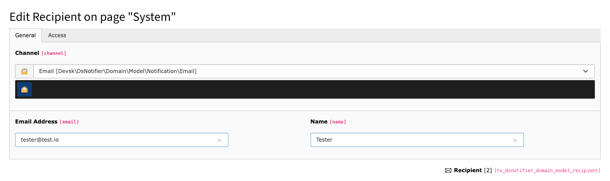
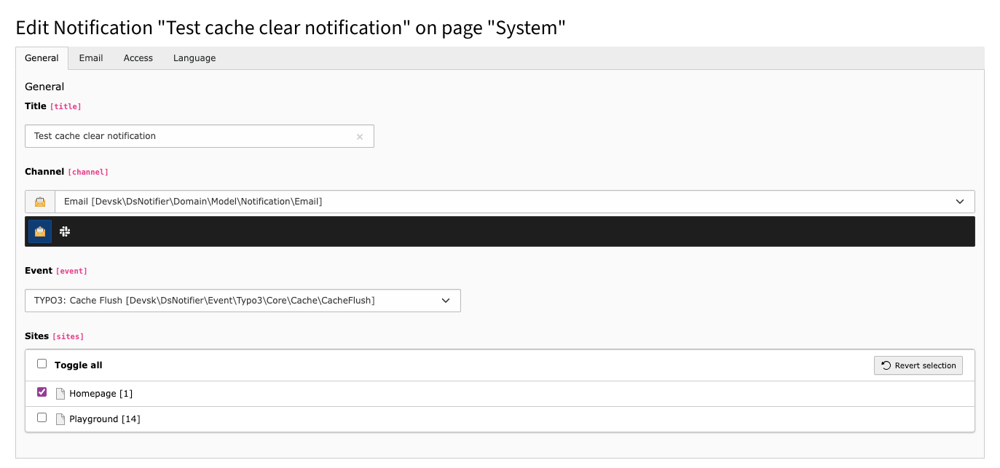
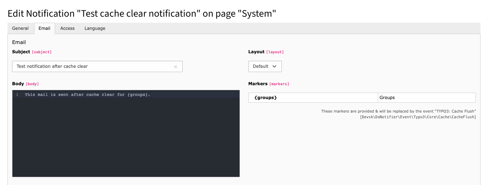
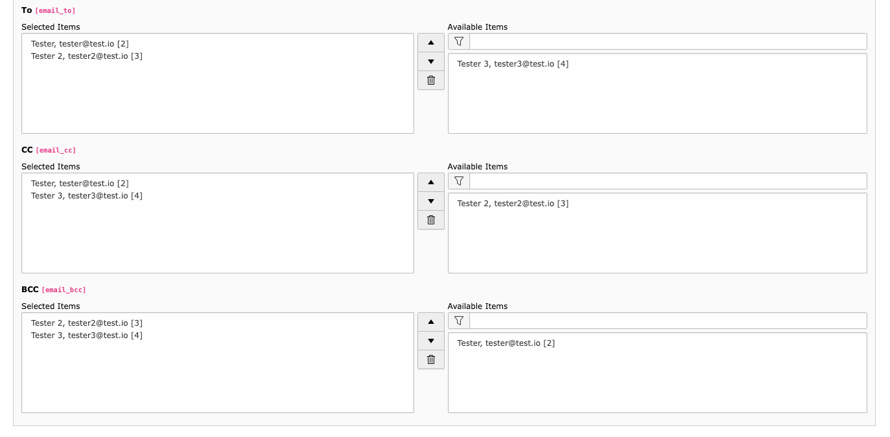

# Notifier

The `ds_notifier` extension for TYPO3 CMS provides a flexible notification system that can handle various notification channels like Email and Slack (upcoming). It allows for dynamic event handling and custom notification configurations.

## Features

- **Dynamic Event Handling**: Utilize custom events to trigger notifications.
- **Multiple Notification Channels**: Supports Email, and potentially more channels in the future (Slack, ...).
- **Event-Driven Notifications**: Configure notifications based on system or custom events.
- **Localization Support**: Comes with built-in support for translations.

## Requirements

- PHP 8.3 or higher
- TYPO3 CMS 12.4 or higher

## Installation

1. Install the extension via Composer:
   ```bash
   composer require devskio/ds_notifier
   ```

2. Run database compare to add the new tables.

## Usage

#### Built-in events
Notiz is shipped with a few built-in events that can be used to trigger notifications.

##### TYPO3: Cache Flush
The [CacheFlush](./Classes/Event/Typo3/Core/Cache/CacheFlush.php) event is triggered when TYPO3's caching system is flushed. This can occur during various system maintenance tasks or via explicit backend actions. Handling this event allows developers to notify system administrators when the cache is cleared.

##### Notifier: Notification Send Error
The [NotificationSendError](./Classes/Event/Notifier/NotificationSendError.php) event is triggered when there is an error during the notification sending process. This event allows for handling errors specifically related to the notification system, such as logging errors, sending alerts to administrators, or attempting to resend notifications. It provides a mechanism to robustly manage failures in the notification delivery process.


##### Form: Submit Finisher
The [SubmitFinisherEvent](./Classes/Event/Form/SubmitFinisherEvent.php) adds new [Form Framework finisher](https://docs.typo3.org/p/typo3/cms-form/main/en-us/DeveloperGuide/Finishers/Index.html) which is triggered at the end of the form submission process in TYPO3's form framework. This event allows for custom actions to be executed after a form has been successfully submitted and processed. It is particularly useful for integrating additional notifications related to form submissions.

### Notifications and recipients configuration
The extension can be configured via TYPO3's backend configuration modules. You can set up different notification channels, layouts, and more.

#### Create a notification recipient
We need to set up Recipient record first, so we can use it later in Notification record. To set up a notification recipient, in Backend navigate to List module and create a new record of type "Recipient". Here we can define for which type of communication channel recipient is meant, either Email or Slack(To be added in future), then fill in the required fields and save the record.



#### Create a notification
To create a notification, in Backend navigate to List module and create a new record of type "Notification". We select for which communication channel is this notification meant, then we can select specific event when this notification is supposed to be sent and for which sites it's supposed to available. 

> **NOTE**: For "Form: Submit Finisher event", we first need to add Notifier finisher as Finisher in form configuration, so we can select this form later in notification record.



After event is selected, we can define, notifications body, layout and see available markers for body, that can be used inside body. 

> **NOTE**: For "Form: Submit Finisher event", we can use form fields like {formValues}.{formFieldHandle} for example {formValues}.{text-1}.


Next we select recipient of the notification, we can select multiple recipients for one notification.



After save, notification should be ready to be sent when respective event is triggered.

### Triggering notifications
Predefined events are triggered by their respective events (cache flush, form submit finisher, error occurrence). But all notifications can be triggered in code by calling TYPO3's `EventDispatcher` and passing event object with optional data. 

```php
$eventDispatcher = GeneralUtility::makeInstance(EventDispatcher::class);
$eventDispatcher->dispatch(new CacheFlush(new CacheFlushEvent($groups)));
```


## Customization

Developers can extend the functionality by creating custom layouts, event handlers or notification channels.

### Custom layouts and templates override
You can create custom layouts for your notifications by adding new layout paths in TypoScript configuration.
```php
notiz {
 notifications {
    entityEmail {
      settings {
        view {
          layouts {
            customLayout {
              label = Custom Layout
              path = Email/Custom
            }
          }
          layoutRootPaths.10 = EXT:ext_name/Resources/Private/Layouts/
          templateRootPaths.10 = EXT:ext_name/Resources/Private/Templates/Email/
          partialRootPaths.10 = EXT:ext_name/Resources/Private/Partials/
        }
      }
    }
  }
}
```

### Predefined recipients and default sender
You can set up predefined recipients and default sender in TypoScript configuration.
```php
notiz {
 notifications {
    entityEmail {
      settings {
        defaultSender = no-reply@domain.io
        globalRecipients {
          10 = tester@test.io
          20 = TYPO3 Admin <admin@domain.io>
        }
      }
    }
  }
}
```

### Custom events
You can create custom events by implementing the `EventInterface` via our class  `AbstractEvent` and dispatching them via TYPO3's `EventDispatcher` in your code.
Each event should have a label and group defined via tags, that are displayed in notification configuration. Language translations can be used. Next each event
can have a specific markers, that can be used in notification body, and specific recipients, that will receive the notification. All this data can be passed from
class to constructor, and then used in event object. All markers will are displayed in notification configuration.

```php
#[NotifierEvent(
    label: 'Custom event notification',
    group: 'Custom events'
)]
class CustomEvent extends AbstractEvent
{
    #[Marker('Custom event value')]
    protected string $customValue = '';
    
    #[Marker('Custom event other')]
    protected string $customOtherValue = '';

    #[Email('Custom event emails')]
    protected $customEmails;

    public function __construct(string $customValue,string $customOtherValue, $customEmails)
    {
        $this->customValue = $customValue;
        $this->customOtherValue = $customOtherValue;
        $this->customEmails = $customEmails;
    }
    
    public function getCustomValue(): string
    {
        return $this->customValue;
    }
    
    public function getCustomOtherValue(): string
    {
        return $this->customOtherValue;
    }

    public function getCustomEmails()
    {
        return $this->customEmails;
    }
}
```

All custom events should be registered in TypoScript configuration, where we can define more information regarding notification.

```php
notiz {
  eventGroups {
    customEvents {
      label = Custom events
      events {
        CustomEvent {
          label = Custom event notification
          description = This event will be triggered at custom code
          className = YourExtension\Domain\Model\NotizEvent\CustomEvent
          configuration {
            flexForm {
              file = EXT:your_extension/Configuration/FlexForms/NotiZ/CustomEvent.xml
            }
          }
          connection { //opytat sa 
            type = signal
            className = Digitalwerk\DwIoeb\Controller\FrontendSimulatorController
            name = CustomEvent
          }
        }
      }
    }
  }
}
```

If email template is created for custom event, it should be placed in `your_extension/Resources/Private/Templates/Email/EventGroupName/CustomEventName.html`. Then that template will be used in for notification body, otherwise default will be used.

### Extending Notification Channels

Custom notification channel can be created by extending the `NotificationInterface` via our custom class  `Notification`. 
In your custom channel class you need to define your notification login in `send()` function.

```php
class CustomNotificationChannel extends Notification
{
    public function send(EventInterface $event): void
    {
        // Your custom notification logic here
    }
}
```
This new notification channel must be registered in Classes.php configuration.

```php
Model\Notification::class => [
        'subclasses' => [
            Model\Notification\CustomNotificationChannel::class => Model\Notification\CustomNotificationChannel::class,
        ],
    ],
    Model\Notification\CustomNotificationChannel::class => [
        'recordType' => Model\Notification\CustomNotificationChannel::class,
        'tableName' => Model\Notification\CustomNotificationChannel::tableName(),
    ],
];
```
## Support

For support, contact the development team at [DEVSK](https://www.devsk.io/).

## License

This project is licensed under the GPL-2.0-or-later. See the `LICENSE` file for more details.
